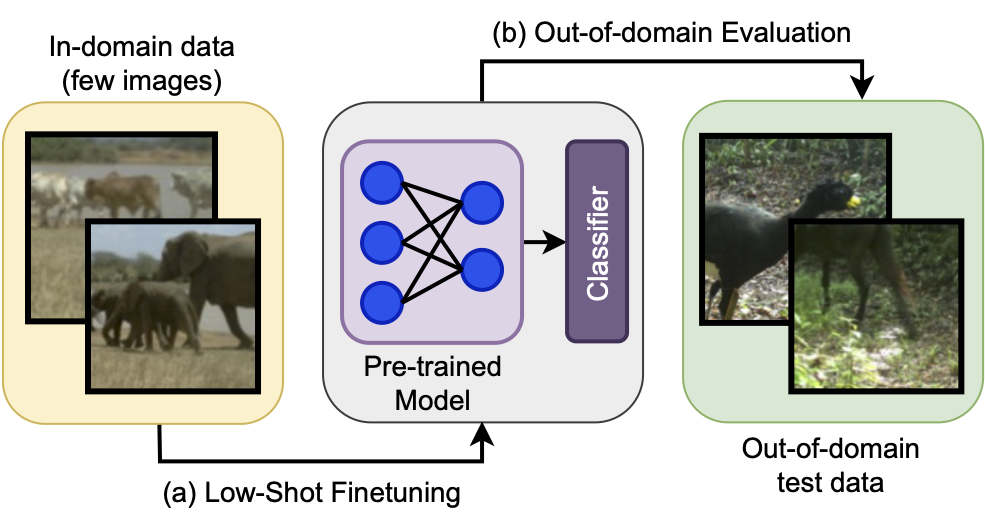

# Benchmarking Low-Shot Robustness To Natural Distribution Shifts

This repository contains the code for our under review paper: Benchmarking Low-Shot Robustness To Natural Distribution Shifts.

## Requirements
* Python 3.8 or newer (preferably through [Conda](https://conda.io/projects/conda/en/latest/user-guide/tasks/manage-python.html)) and [Cyanure](http://thoth.inrialpes.fr/people/mairal/cyanure/welcome.html#installation).
* Install [WILDS benchmark](https://github.com/p-lambda/wilds) as a package and [other requirements](https://github.com/p-lambda/wilds#requirements).

## Datasets
* Please refer to [WiSE-FT](https://github.com/mlfoundations/wise-ft/blob/master/datasets.md) and [WILDS benchmark](https://github.com/p-lambda/wilds#data) for downloading the datasets.
* The low-shot subsets used in the paper can be found in the [subsets](https://github.com/Aaditya-Singh/Low-Shot-Robustness/tree/main/subsets) folder.

## Standard models (pre-trained on ImageNet)
<table>
  <tr>
    <td> MSN checkpoints </td>
    <td><a href="https://github.com/facebookresearch/msn#pre-trained-models">download</a></td>
  </tr>
  <tr>
    <td> DINO checkpoints </td>
    <td><a href="https://github.com/facebookresearch/dino#pretrained-models">download</a></td>
  </tr>
  <tr>
    <td> DEIT checkpoints </td>
    <td><a href="https://github.com/facebookresearch/deit/blob/main/README_deit.md">download</a></td>
  </tr>
  <tr>
    <td> SwAV checkpoints </td>
    <td><a href="https://github.com/facebookresearch/swav#model-zoo">download</a></td>
  </tr>
</table>

## Training and Testing

The bash commands used for fine-tuning can be found in the [commands directory](https://github.com/Aaditya-Singh/Low-Shot-Robustness/tree/main/commands). Methods other than Logistic Regression and Mean Centroid Classifier additionally make use of the [config yamls](https://github.com/Aaditya-Singh/Low-Shot-Robustness/tree/main/configs). We summarize some of the important flags and/or fields for experimentation below:

* `root_path_train/test`: Set the root path containing the image folders for training or testing, e.g. `../datasets/`
* `image_folder_train/test`: Set the image folder containing the images for the different classes, e.g. `imagenet/`
* `val_split`: Should be set to `id_val` for training and `val` for out-of-domain (OOD) testing for WILDS datasets.
* `training`: Set to `true` for training and `false` for evaluation.
* `finetuning`: Set to `true` for full fine-tuning and `false` for training only the classifier.
* `eval_type`: Should be set to `bslplpl` for Baseline++. Default is `lineval`.
* `folder` and `pretrained_path`: Specifies folder to save model weights to and path to load model weights from.

For more details and parameters than the ones provided here, please refer to the `--help` option. Details for full-finetuning on ImageNet can be found in our [MAE codebase](https://github.com/Aaditya-Singh/MAE).

## Robustness Interventions

- This codebase provides support for [LP-FT](https://arxiv.org/abs/2202.10054) and [WiSE-FT](https://github.com/mlfoundations/wise-ft) interventions.
- For CLIP, the `clip` model should be [loaded](https://github.com/openai/CLIP#cliploadname-device-jitfalse) and `clip.visual` weights should be saved offline.
- CLIP's zero-shot head weights can be saved with the command provided [here](https://github.com/Aaditya-Singh/Low-Shot-Robustness/blob/main/commands/save_wiseft_weights.sh).
- Set `finetuning` to `true` and `eval_type` to `zeroshot` for full fine-tuning with these weights.
- This command with `Type=wiseft` can be used to save WiSE-FT weights after full fine-tuning.
- Please refer to our [RobustViT codebase](https://github.com/Aaditya-Singh/RobustViT) 
 and [Model Soups](https://github.com/mlfoundations/model-soups) for other interventions.

## References

We follow these repositories and thank the authors for open-sourcing their code.

- [1]: [Masked Siamese Networks](https://github.com/facebookresearch/msn)
- [2]: [Masked Autoencoders](https://github.com/facebookresearch/mae)
